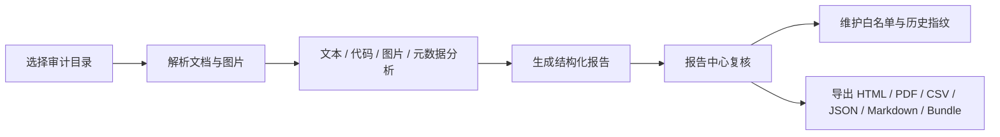
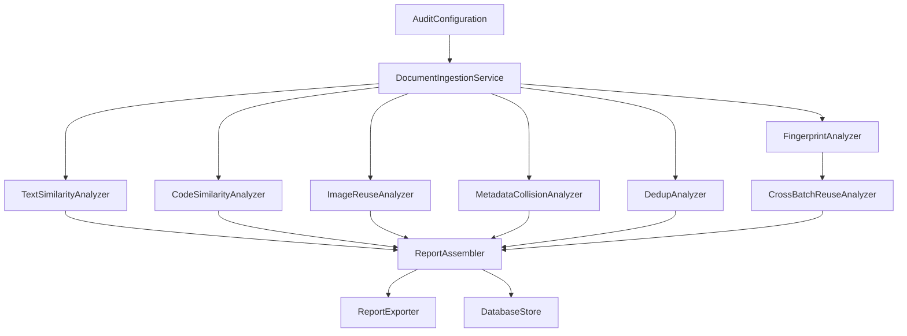

<p align="center">
  
</p>
<h1 align="center">PitcherPlant（猪笼草）</h1>

<p align="center">
  <strong>macOS 原生 WriteUP 审计工作台</strong>
</p>
<p align="center">
  比赛是为了选拔人才，选拔人才最基本的就是公平。面向 CTF 与网络安全竞赛提交 WriteUP 进行快速复核，解析文档、图片、代码片段与历史指纹，生成结构化相似性证据报告，让公平真切落实。
</p>


<p align="center">
  
  
  
  
  
</p>

<p align="center">
  <a href="#快速开始">快速开始</a>
  · <a href="#功能亮点">功能亮点</a>
  · <a href="#检测模型">检测模型</a>
  · <a href="#架构">架构</a>
  · <a href="#开发命令">开发命令</a>
</p>

---

## 猪笼草

PitcherPlant（猪笼草）是一款本地运行的 macOS 审计应用。通过读取比赛 WriteUP 目录，提取正文、代码片段、Office/PDF 元数据、嵌入图片和 SimHash 指纹，帮助审计人员定位疑似复用、改写和跨批次重复提交。这是吊椅宝宝在之前某场比赛凌晨 4 点审计近 1200 份 WriteUP 时突发奇想而想做的一件事。或许真的有许多比赛主办方从来不审计，或者许多东西只是一个形式，但是我们最初的目的依旧是：比赛是为了选拔人才，选拔人才最基本的就是公平。

<table>
  <tr>
    <td><strong>本地原生</strong><br>SwiftUI 桌面应用，数据默认保存在工作区本地 SQLite。</td>
    <td><strong>面向 WriteUP</strong><br>围绕 CTF/安全竞赛提交材料复核组织审计流程。</td>
  </tr>
  <tr>
    <td><strong>多证据链</strong><br>文本、代码、图片、元数据、重复提交和历史指纹统一进入报告。</td>
    <td><strong>可追溯</strong><br>报告、任务、指纹、白名单和导出记录持久化保存。</td>
  </tr>
</table>


## 功能亮点

| 能力 | 说明 |
| --- | --- |
| 文档摄取 | 递归扫描审计目录，读取 `pdf`、`docx`、`md`、`txt`、`html`、`rtf`、`pptx`、源码文件和独立图片，跳过 `~$draft.docx` 这类 Office 临时文件。 |
| DOCX 解析 | 提取正文、作者、最后修改者和 `word/media/*` 嵌入图片。 |
| PDF 解析 | 通过 PDFKit 提取文本和作者元数据，读取内嵌图片流，并使用页级缩略图兜底。 |
| 文本相似 | 基于 TF-IDF 与 cosine similarity 比对清洗后的 WriteUP 文本。 |
| 代码相似 | 提取 fenced code 与启发式代码片段，计算词元与结构相似度。 |
| 图片复用 | 基于 pHash、aHash、dHash 的汉明距离匹配图片证据。 |
| 元数据碰撞 | 按作者和最后修改者字段聚合可疑交叉来源。 |
| 跨批次复用 | 保存 SimHash 指纹，并与历史批次指纹做位差匹配。 |
| 白名单 | 支持作者、文件名、文本片段、代码模板、图片 Hash、元数据和路径规则。 |
| 批量导入 | 支持 ZIP、嵌套目录和队伍目录识别，导入后生成队列任务并串行执行。 |
| 证据复核 | 证据行支持确认、误报、忽略、加入白名单、严重度覆盖和备注持久化。 |
| 报告中心 | 展示总览、文本、代码、图片、元数据、重复、指纹、跨批次章节，并按风险排序查看。 |
| 导出 | 支持 HTML、PDF、CSV、JSON、Markdown 和 Evidence Bundle ZIP。 |

## 快速开始

从仓库根目录打开 workspace：

```bash
open PitcherPlant.xcworkspace
```

在 Xcode 中选择 `PitcherPlantApp` scheme，运行目标选择 `My Mac`，然后启动应用。

命令行构建并启动：

```bash
cd PitcherPlantApp
./script/build_and_run.sh
```

验证应用进程：

```bash
cd PitcherPlantApp
./script/build_and_run.sh --verify
```

运行脚本使用 `xcodebuild` 构建 Debug 版本，并启动以下 app bundle：

```text
PitcherPlantApp/.build/xcode/Build/Products/Debug/PitcherPlant.app
```

## 使用流程



1. 打开应用，进入工作台查看任务、报告、指纹和白名单数量。
2. 进入 **新建审计**。
3. 设置审计目录、输出目录和报告文件名模板。
4. 调整文本阈值、重复阈值、图片阈值、SimHash 阈值、Vision OCR 和白名单模式。
5. 启动审计任务。
6. 在 **报告中心** 查看证据章节、风险排序、详情、附件和指纹记录。
7. 对证据执行确认、误报、忽略、白名单和备注复核。
8. 批量提交包可从 **新建审计** 导入，系统会生成队列任务并串行运行。
9. 将选中报告导出为 HTML、PDF、CSV、JSON、Markdown 或 Evidence Bundle ZIP。

## 检测模型

| 模块 | 输入 | 方法 | 输出 |
| --- | --- | --- | --- |
| `TextSimilarityAnalyzer` | 清洗后的正文 | TF-IDF + cosine similarity | 文本相似文件对 |
| `CodeSimilarityAnalyzer` | fenced code 与启发式代码片段 | lexical shingles + structural tokens | 代码结构相似证据 |
| `ImageReuseAnalyzer` | DOCX/PDF 图片 | pHash / aHash / dHash 位差 | 图片复用证据与缩略图 |
| `MetadataCollisionAnalyzer` | 作者与最后修改者 | 字段聚合与通用作者过滤 | 元数据碰撞记录 |
| `DedupAnalyzer` | 清洗后的正文 | 更严格文本阈值 | 近重复文件对 |
| `CrossBatchReuseAnalyzer` | 当前与历史 SimHash | 汉明距离 + 白名单规则 | 跨批次复用记录 |

## 配置

默认配置来自 `AuditConfiguration.defaults(for:)`：

| 配置项 | 默认值 |
| --- | --- |
| 输入目录 | `Fixtures/WriteupSamples/date` |
| 输出目录 | `GeneratedReports/full` |
| 报告文件名模板 | `{dir}_PitcherPlant_{date}.html` |
| 文本相似阈值 | `0.75` |
| 重复检测阈值 | `0.85` |
| 图片哈希位差阈值 | `5` |
| SimHash 位差阈值 | `4` |
| Vision OCR | 开启 |
| 白名单模式 | 标记命中项 |

## 架构

```text
PitcherPlant/
├── Docs/
├── Fixtures/
├── GeneratedReports/
├── PitcherPlant.xcworkspace/
└── PitcherPlantApp/
    ├── Package.swift
    ├── Package.resolved
    ├── project.yml
    ├── PitcherPlantApp.xcodeproj
    ├── Resources/
    ├── script/
    ├── Sources/PitcherPlantApp/
    │   ├── App/
    │   ├── Core/
    │   ├── Features/
    │   ├── Models/
    │   ├── Persistence/
    │   └── Support/
    └── Tests/PitcherPlantAppTests/
```

| 路径 | 职责 |
| --- | --- |
| `App/` | SwiftUI 应用入口、共享状态、菜单命令 |
| `Core/` | 文档摄取、审计运行器、分析器、报告导出 |
| `Features/` | 主窗口、报告中心、设置页 |
| `Models/` | 审计、报告、设置、指纹、白名单模型 |
| `Persistence/` | GRDB 数据库和结构升级 |
| `Support/` | 工作区定位、本地化、主题、报告过滤 |
| `Tests/PitcherPlantAppTests/` | 摄取、分析器、报告、数据库、导入测试 |

审计流水线：



## 数据存储

PitcherPlant 启动时解析工作区根目录。首选数据库位置：

```text
.pitcherplant-macos/PitcherPlantMac.sqlite
```

工作区写入受限时使用：

```text
~/Library/Application Support/PitcherPlant/.pitcherplant-macos/PitcherPlantMac.sqlite
```

本地生成目录：

```text
.pitcherplant-macos/
GeneratedReports/
PitcherPlantApp/.build/
PitcherPlantApp/.pitcherplant-macos/
PitcherPlantApp/reports/
```

这些路径已加入 `.gitignore`。

## 开发命令

安装 XcodeGen：

```bash
brew install xcodegen
```

生成 Xcode 工程：

```bash
cd PitcherPlantApp
xcodegen generate
```

运行 SwiftPM 测试：

```bash
cd PitcherPlantApp
swift package clean
swift test
```

构建 macOS App：

```bash
cd PitcherPlantApp
xcodebuild -project PitcherPlantApp.xcodeproj -scheme PitcherPlantApp -destination 'platform=macOS' build
```

运行 Xcode scheme 测试：

```bash
cd PitcherPlantApp
xcodebuild -project PitcherPlantApp.xcodeproj -scheme PitcherPlantApp -destination 'platform=macOS' test
```

命名关系：

| 场景 | 名称 |
| --- | --- |
| SwiftPM executable target/product | `PitcherPlantApp` |
| Xcode scheme | `PitcherPlantApp` |
| App bundle/product | `PitcherPlant` |

依赖锁定：

| 依赖 | 版本 |
| --- | --- |
| `GRDB.swift` | 7.10.0 |
| `ZIPFoundation` | 0.9.20 |

## 当前进度

- 已落地：批量提交包导入、队列串行执行、失败任务重试、证据复核持久化、证据级风险聚合、扩展输入解析、扩展导出、白名单建议、候选召回、指纹包导入导出、标签清理、可选审计辅助解释、CI 和发布 workflow。
- 已补齐：证据查看器高亮与跳转、代码逐行 diff、图片证据来源展示、跨批次复用图谱、校准 fixture、性能指标基线和 ad-hoc 发布打包验证。
- 发布说明：当前 Release workflow 默认生成 ad-hoc 签名 ZIP/DMG，不依赖 Apple Developer 付费账号；后续如配置 Developer ID 证书和公证 secrets，可切换到 `developer-id` 分发模式。详见 [Docs/RELEASE.md](Docs/RELEASE.md)。

## License

本项目采用 MIT License，详见 [LICENSE](LICENSE)。
