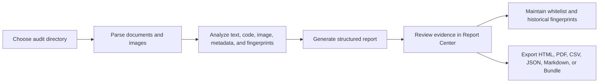
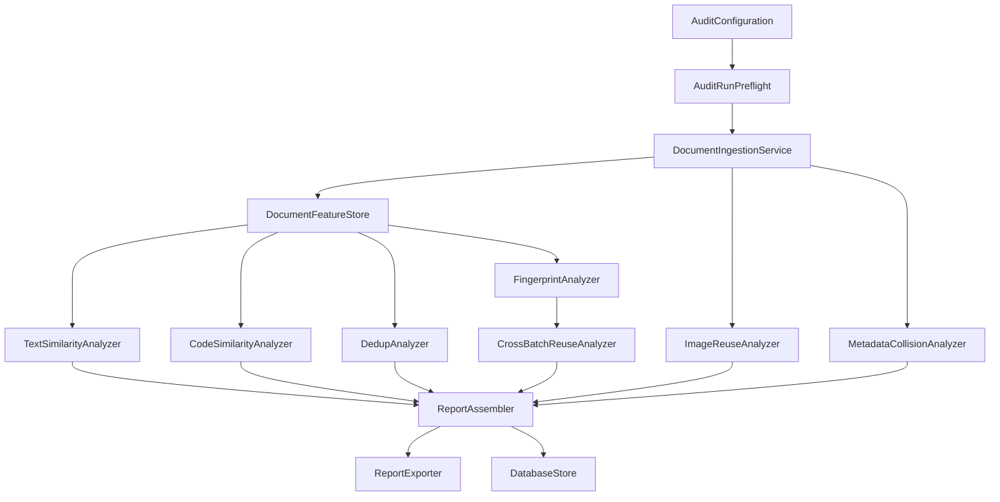

<p align="center">
  
</p>

<h1 align="center">PitcherPlant</h1>

<p align="center">
  <strong>Native macOS WriteUP audit workbench for security competitions.</strong>
</p>

<p align="center">
  
  
  
  
  
</p>

<p align="center">
  <a href="#overview">Overview</a>
  · <a href="#features">Features</a>
  · <a href="#quick-start">Quick Start</a>
  · <a href="#workflow">Workflow</a>
  · <a href="#architecture">Architecture</a>
  · <a href="#development">Development</a>
  · <a href="README.zh-CN.md">简体中文</a>
</p>

## Overview

PitcherPlant is a local-first macOS app for auditing security competition WriteUP submissions. It scans a submission directory, extracts text, code snippets, Office/PDF metadata, embedded images, standalone images, and SimHash fingerprints, then builds a structured evidence report for human review.

The app is built for organizers and reviewers who need to find suspicious reuse, rewritten reports, duplicated submissions, reused images, shared metadata, and cross-batch repetition across historical fingerprints. All core data is stored locally in SQLite through GRDB.

## Features

| Area | Capability |
| --- | --- |
| Native desktop | SwiftUI macOS app with a workspace dashboard, audit queue, report center, evidence inspector, fingerprint library, whitelist library, and settings surface. |
| Local persistence | Reports, jobs, evidence review state, fingerprints, whitelist rules, imports, and export records are stored in a local SQLite database. |
| Document ingestion | Recursively scans `pdf`, `docx`, `pptx`, `md`, `txt`, `html`, `htm`, `rtf`, source files, and standalone images. Office temporary files such as `~$draft.docx` are skipped. |
| DOCX/PPTX parsing | Extracts document text, author metadata, last-modified-by metadata, slide text, and embedded media from Office archives. |
| PDF parsing | Extracts text and author metadata with PDFKit, reads embedded image streams, and uses page thumbnails as a fallback. |
| Text similarity | Uses TF-IDF with word and character n-grams plus cosine similarity to detect suspiciously similar WriteUP text. |
| Code similarity | Extracts fenced code and heuristic code blocks, then compares lexical shingles, structural tokens, and shared token coverage. |
| Image reuse | Computes perceptual hash, average hash, and difference hash values, then compares image evidence with Hamming distance. |
| Metadata collisions | Groups suspicious overlaps in author and last-modified-by fields. |
| Cross-batch reuse | Stores SimHash fingerprints and compares new submissions against historical batches with exact Hamming-distance semantics. |
| Whitelist workflow | Supports author, filename, text fragment, code template, image hash, metadata, and path rules. Matches can be marked or hidden. |
| Batch import | Imports ZIP files, nested folders, and team directories into queued audit jobs. Jobs run serially and can be retried. |
| Evidence review | Evidence rows support confirmed, false positive, ignored, favorite, watched, severity override, notes, and whitelist actions. |
| Report center | Shows overview, text, code, image, metadata, deduplication, fingerprint, and cross-batch sections with risk sorting and detail inspection. |
| Export | Exports HTML, PDF, CSV, JSON, Markdown, and Evidence Bundle ZIP packages. |
| Large workspace handling | Uses paged database reads, incremental job event writes, audit preflight checks, cancellable parsing loops, report filtering caches, image caches, code diff caches, and bounded graph rendering. |

## Supported Inputs

| Type | Extensions |
| --- | --- |
| Documents | `pdf`, `docx`, `pptx`, `md`, `txt`, `html`, `htm`, `rtf` |
| Source code | `py`, `c`, `cc`, `cpp`, `h`, `hpp`, `java`, `go`, `js`, `jsx`, `ts`, `tsx`, `swift`, `sh`, `bash`, `zsh`, `rb`, `rs`, `php`, `cs`, `kt`, `sql`, `m`, `mm` |
| Images | `png`, `jpg`, `jpeg`, `gif`, `bmp`, `tiff`, `webp` |
| Batch imports | ZIP archives and nested submission directories |

## Quick Start

Open the workspace from the repository root:

```bash
open PitcherPlant.xcworkspace
```

In Xcode, select the `PitcherPlantApp` scheme, choose `My Mac` as the run destination, and launch the app.

Build and run from the command line:

```bash
cd PitcherPlantApp
./script/build_and_run.sh
```

Build, launch, and verify that the app process is running:

```bash
cd PitcherPlantApp
./script/build_and_run.sh --verify
```

The helper script builds the Debug app with `xcodebuild` and launches:

```text
PitcherPlantApp/.build/xcode/Build/Products/Debug/PitcherPlant.app
```

## Workflow



1. Open PitcherPlant and review workspace counts for jobs, reports, fingerprints, and whitelist rules.
2. Open **New Audit**.
3. Choose the audit directory, output directory, and report file name template.
4. Adjust text similarity, deduplication, image hash distance, SimHash distance, Vision OCR, and whitelist behavior.
5. Start the audit job.
6. Review findings in **Report Center** by evidence type, risk score, section, and search query.
7. Open evidence in the inspector to compare text, code, image attachments, metadata, source references, and review notes.
8. Mark evidence as confirmed, false positive, ignored, favorite, or watched.
9. Add whitelist rules when repeated legitimate templates or known sources appear.
10. Export the selected report as HTML, PDF, CSV, JSON, Markdown, or Evidence Bundle ZIP.

## Detection Model

| Analyzer | Input | Method | Output |
| --- | --- | --- | --- |
| `TextSimilarityAnalyzer` | Normalized document text | TF-IDF, word n-grams, character n-grams, cosine similarity | Similar WriteUP pairs with shared context attachments |
| `CodeSimilarityAnalyzer` | Fenced code and heuristic code blocks | Lexical shingles, structural signatures, shared token ratio | Similar code pairs with token and structure details |
| `ImageReuseAnalyzer` | Embedded and standalone images | pHash, aHash, dHash, Hamming distance | Reused-image evidence with thumbnails and source references |
| `MetadataCollisionAnalyzer` | Author and last-modified-by metadata | Field grouping with common-author filtering | Metadata collision rows |
| `DedupAnalyzer` | Normalized document text | Stricter text similarity threshold | Near-duplicate file pairs |
| `FingerprintAnalyzer` | Parsed document text | SimHash fingerprinting | Current-batch fingerprint records |
| `CrossBatchReuseAnalyzer` | Current and historical SimHash records | Hamming distance with direct scan or BK-tree index | Cross-batch reuse matches |

Evidence is decision support for reviewers. Final enforcement decisions should consider competition rules, context, and manual verification.

## Configuration

Default values come from `AuditConfiguration.defaults(for:)`.

| Setting | Default |
| --- | --- |
| Input directory | `Fixtures/WriteupSamples/date` |
| Output directory | `GeneratedReports/full` |
| Report name template | `{dir}_PitcherPlant_{date}.html` |
| Text similarity threshold | `0.75` |
| Deduplication threshold | `0.85` |
| Image hash distance threshold | `5` |
| SimHash distance threshold | `4` |
| Vision OCR | Enabled |
| Whitelist mode | Mark matches |

The toolbar also exposes scan profiles:

| Profile | Behavior |
| --- | --- |
| Standard | Uses the default thresholds above. |
| Deep | Lowers text and deduplication thresholds, increases image and SimHash distance, keeps OCR enabled. |
| Quick | Raises text and deduplication thresholds, tightens image and SimHash distance, disables OCR. |
| Evidence Review | Tunes thresholds for broader review and uses the `{dir}_EvidenceReview_{date}.html` report template. |
| Fast Screening | Uses quick scanning and the `{dir}_QuickScreen_{date}.html` report template. |

## Architecture

```text
PitcherPlant/
├── Docs/
├── Fixtures/
├── GeneratedReports/
├── PitcherPlant.xcworkspace/
└── PitcherPlantApp/
    ├── Package.swift
    ├── Package.resolved
    ├── project.yml
    ├── PitcherPlantApp.xcodeproj
    ├── Resources/
    ├── script/
    ├── Sources/PitcherPlantApp/
    │   ├── App/
    │   ├── Core/
    │   ├── Features/
    │   ├── Models/
    │   ├── Persistence/
    │   └── Support/
    └── Tests/PitcherPlantAppTests/
```

| Path | Responsibility |
| --- | --- |
| `App/` | SwiftUI app entry point, shared app state, commands, and window setup. |
| `Core/` | Document ingestion, analyzers, audit runner, risk scoring, report assembly, export, batch import, and fingerprint packaging. |
| `Features/` | Main window, workspace dashboard, report center, evidence inspector, libraries, and settings views. |
| `Models/` | Audit configuration, jobs, reports, evidence, settings, fingerprints, and whitelist models. |
| `Persistence/` | GRDB-backed SQLite store, schema migrations, paged reads, event writes, and review-state persistence. |
| `Support/` | Workspace discovery, localization, theme, layout surfaces, typography, filtering, and environment helpers. |
| `Tests/PitcherPlantAppTests/` | Unit and integration tests for ingestion, analyzers, reports, persistence, imports, cancellation, caching, and performance-sensitive helpers. |

Audit pipeline:



## Data Storage

PitcherPlant resolves a workspace root at launch. The preferred database location is:

```text
.pitcherplant-macos/PitcherPlantMac.sqlite
```

When the workspace is read-only, the fallback location is:

```text
~/Library/Application Support/PitcherPlant/.pitcherplant-macos/PitcherPlantMac.sqlite
```

Local generated paths:

```text
.pitcherplant-macos/
GeneratedReports/
PitcherPlantApp/.build/
PitcherPlantApp/.pitcherplant-macos/
PitcherPlantApp/reports/
PitcherPlantApp/build/
```

These paths are ignored by Git.

## Development

Install XcodeGen:

```bash
brew install xcodegen
```

Regenerate the Xcode project:

```bash
cd PitcherPlantApp
xcodegen generate
```

Run SwiftPM tests:

```bash
cd PitcherPlantApp
swift test
```

Run Xcode scheme tests:

```bash
cd PitcherPlantApp
xcodebuild -project PitcherPlantApp.xcodeproj -scheme PitcherPlantApp -destination 'platform=macOS' test
```

Build the Release app:

```bash
cd PitcherPlantApp
xcodebuild -project PitcherPlantApp.xcodeproj -scheme PitcherPlantApp -destination 'platform=macOS' -configuration Release build
```

Check whitespace before committing:

```bash
git diff --check
```

Project naming:

| Context | Name |
| --- | --- |
| SwiftPM package | `PitcherPlantApp` |
| SwiftPM executable product | `PitcherPlantApp` |
| Xcode scheme | `PitcherPlantApp` |
| App bundle and product | `PitcherPlant` |
| Bundle identifier | `com.pitcherplant.desktop` |

Dependencies:

| Dependency | Version policy | Current resolved version |
| --- | --- | --- |
| `GRDB.swift` | from `7.0.0` | `7.10.0` |
| `ZIPFoundation` | from `0.9.19` | `0.9.20` |

## Release

Create local ad-hoc release artifacts:

```bash
cd PitcherPlantApp
./script/package_release.sh --distribution ad-hoc
```

Artifacts are written to:

```text
PitcherPlantApp/build/export/PitcherPlant.app
PitcherPlantApp/build/dist/PitcherPlant-macOS.zip
PitcherPlantApp/build/dist/PitcherPlant-macOS.dmg
PitcherPlantApp/build/dist/PitcherPlant.xcarchive.zip
PitcherPlantApp/build/dist/PitcherPlant-dSYMs.zip
PitcherPlantApp/build/dist/PitcherPlant-macOS-checksums.txt
PitcherPlantApp/build/dist/release-notes.md
```

The release script performs archive, export, ZIP/DMG packaging, code-sign verification, DMG verification, unpack checks, mount checks, and SHA-256 checksum generation.

Developer ID distribution is available through:

```bash
cd PitcherPlantApp
./script/package_release.sh --distribution developer-id --notarize
```

Required Developer ID environment variables are documented in [Docs/RELEASE.md](Docs/RELEASE.md).

## Related Docs

- [Project structure](Docs/PROJECT_STRUCTURE.md)
- [Release and acceptance](Docs/RELEASE.md)
- [Third-party notices](Docs/THIRD_PARTY_NOTICES.md)

## License

PitcherPlant is released under the MIT License. See [LICENSE](LICENSE).
