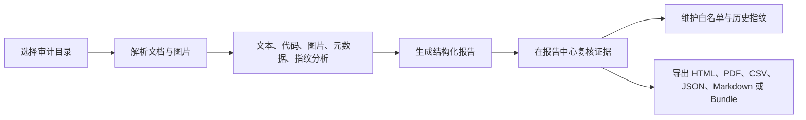
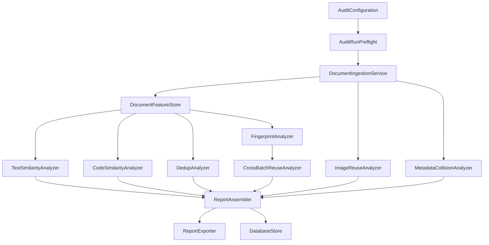

<p align="center">
  
</p>

<h1 align="center">PitcherPlant（猪笼草）</h1>

<p align="center">
  <strong>面向安全竞赛 WriteUP 审计的 macOS 原生工作台。</strong>
</p>

<p align="center">
  
  
  
  
  
</p>

<p align="center">
  <a href="#项目概览">项目概览</a>
  · <a href="#功能能力">功能能力</a>
  · <a href="#快速开始">快速开始</a>
  · <a href="#使用流程">使用流程</a>
  · <a href="#架构">架构</a>
  · <a href="#开发命令">开发命令</a>
  · <a href="README.md">English</a>
</p>

## 项目概览

PitcherPlant 是一款本地优先的 macOS 审计应用，用于复核安全竞赛 WriteUP 提交。它会扫描提交目录，提取正文、代码片段、Office/PDF 元数据、嵌入图片、独立图片和 SimHash 指纹，并生成结构化证据报告供审计人员复核。

它适合赛事组织方和审计人员定位疑似复用、洗稿、重复提交、图片复用、元数据交叉来源和跨批次重复。核心数据默认保存在本地 SQLite 数据库中，通过 GRDB 访问。

## 功能能力

| 模块 | 能力 |
| --- | --- |
| 原生桌面端 | SwiftUI macOS 应用，包含工作台、审计队列、报告中心、证据 Inspector、指纹库、白名单库和设置页。 |
| 本地持久化 | 报告、任务、证据复核状态、指纹、白名单、导入记录和导出记录写入本地 SQLite。 |
| 文档摄取 | 递归扫描 `pdf`、`docx`、`pptx`、`md`、`txt`、`html`、`htm`、`rtf`、源码文件和独立图片，跳过 `~$draft.docx` 这类 Office 临时文件。 |
| DOCX/PPTX 解析 | 从 Office 包中提取正文、作者、最后修改者、幻灯片文本和嵌入媒体。 |
| PDF 解析 | 使用 PDFKit 提取文本和作者元数据，读取内嵌图片流，并使用页级缩略图作为兜底。 |
| 文本相似 | 使用 TF-IDF、词级 n-gram、字符级 n-gram 和 cosine similarity 检测 WriteUP 正文相似。 |
| 代码相似 | 提取 fenced code 和启发式代码片段，比对词元 shingles、结构签名和共享 token 覆盖率。 |
| 图片复用 | 计算 pHash、aHash、dHash，并基于汉明距离生成图片复用证据。 |
| 元数据碰撞 | 按作者和最后修改者字段聚合可疑交叉来源。 |
| 跨批次复用 | 保存 SimHash 指纹，并使用精确汉明距离语义比对历史批次。 |
| 白名单流程 | 支持作者、文件名、文本片段、代码模板、图片 Hash、元数据和路径规则，命中项可标记或隐藏。 |
| 批量导入 | 支持 ZIP、嵌套目录和队伍目录识别，导入后生成队列任务并串行执行。 |
| 证据复核 | 证据行支持确认、误报、忽略、收藏、关注、严重度覆盖、备注和加入白名单。 |
| 报告中心 | 展示总览、文本、代码、图片、元数据、重复、指纹和跨批次章节，支持风险排序和详情检查。 |
| 导出 | 支持 HTML、PDF、CSV、JSON、Markdown 和 Evidence Bundle ZIP。 |
| 大规模工作区 | 使用分页数据库读取、任务事件增量写入、审计预检、可取消解析循环、报告过滤缓存、图片缓存、代码 diff 缓存和图谱裁剪。 |

## 支持输入

| 类型 | 扩展名 |
| --- | --- |
| 文档 | `pdf`、`docx`、`pptx`、`md`、`txt`、`html`、`htm`、`rtf` |
| 源码 | `py`、`c`、`cc`、`cpp`、`h`、`hpp`、`java`、`go`、`js`、`jsx`、`ts`、`tsx`、`swift`、`sh`、`bash`、`zsh`、`rb`、`rs`、`php`、`cs`、`kt`、`sql`、`m`、`mm` |
| 图片 | `png`、`jpg`、`jpeg`、`gif`、`bmp`、`tiff`、`webp` |
| 批量导入 | ZIP 包和嵌套提交目录 |

## 快速开始

从仓库根目录打开 workspace：

```bash
open PitcherPlant.xcworkspace
```

在 Xcode 中选择 `PitcherPlantApp` scheme，运行目标选择 `My Mac`，然后启动应用。

命令行构建并启动：

```bash
cd PitcherPlantApp
./script/build_and_run.sh
```

构建、启动并确认进程存在：

```bash
cd PitcherPlantApp
./script/build_and_run.sh --verify
```

脚本会通过 `xcodebuild` 构建 Debug 版本，并启动以下 app bundle：

```text
PitcherPlantApp/.build/xcode/Build/Products/Debug/PitcherPlant.app
```

## 使用流程



1. 打开 PitcherPlant，在工作台查看任务、报告、指纹和白名单数量。
2. 进入 **新建审计**。
3. 选择审计目录、输出目录和报告文件名模板。
4. 调整文本相似阈值、重复阈值、图片哈希位差、SimHash 位差、Vision OCR 和白名单行为。
5. 启动审计任务。
6. 在 **报告中心** 按证据类型、风险分数、章节和搜索词复核结果。
7. 在 Inspector 中查看文本、代码、图片附件、元数据、来源引用和复核备注。
8. 将证据标记为确认、误报、忽略、收藏或关注。
9. 对合法模板或已知来源添加白名单规则。
10. 将选中报告导出为 HTML、PDF、CSV、JSON、Markdown 或 Evidence Bundle ZIP。

## 检测模型

| 分析器 | 输入 | 方法 | 输出 |
| --- | --- | --- | --- |
| `TextSimilarityAnalyzer` | 归一化正文 | TF-IDF、词级 n-gram、字符级 n-gram、cosine similarity | 文本相似文件对和共享上下文附件 |
| `CodeSimilarityAnalyzer` | fenced code 与启发式代码片段 | 词元 shingles、结构签名、共享 token 比例 | 代码相似文件对和词元/结构细节 |
| `ImageReuseAnalyzer` | 嵌入图片与独立图片 | pHash、aHash、dHash、汉明距离 | 图片复用证据、缩略图和来源引用 |
| `MetadataCollisionAnalyzer` | 作者与最后修改者元数据 | 字段聚合和通用作者过滤 | 元数据碰撞记录 |
| `DedupAnalyzer` | 归一化正文 | 更严格的文本相似阈值 | 近重复文件对 |
| `FingerprintAnalyzer` | 解析后的正文 | SimHash 指纹 | 当前批次指纹记录 |
| `CrossBatchReuseAnalyzer` | 当前与历史 SimHash 记录 | 直接扫描或 BK-tree 索引下的汉明距离 | 跨批次复用记录 |

证据用于辅助审计判断。最终处置应结合赛事规则、上下文和人工复核结论。

## 配置

默认值来自 `AuditConfiguration.defaults(for:)`。

| 配置项 | 默认值 |
| --- | --- |
| 输入目录 | `Fixtures/WriteupSamples/date` |
| 输出目录 | `GeneratedReports/full` |
| 报告文件名模板 | `{dir}_PitcherPlant_{date}.html` |
| 文本相似阈值 | `0.75` |
| 重复检测阈值 | `0.85` |
| 图片哈希位差阈值 | `5` |
| SimHash 位差阈值 | `4` |
| Vision OCR | 开启 |
| 白名单模式 | 标记命中项 |

工具栏还提供扫描配置：

| 配置 | 行为 |
| --- | --- |
| Standard | 使用默认阈值。 |
| Deep | 降低文本和重复阈值，放宽图片和 SimHash 位差，保持 OCR 开启。 |
| Quick | 提高文本和重复阈值，收紧图片和 SimHash 位差，关闭 OCR。 |
| Evidence Review | 使用更适合广泛复核的阈值，并采用 `{dir}_EvidenceReview_{date}.html` 模板。 |
| Fast Screening | 使用快速扫描配置，并采用 `{dir}_QuickScreen_{date}.html` 模板。 |

## 架构

```text
PitcherPlant/
├── Docs/
├── Fixtures/
├── GeneratedReports/
├── PitcherPlant.xcworkspace/
└── PitcherPlantApp/
    ├── Package.swift
    ├── Package.resolved
    ├── project.yml
    ├── PitcherPlantApp.xcodeproj
    ├── Resources/
    ├── script/
    ├── Sources/PitcherPlantApp/
    │   ├── App/
    │   ├── Core/
    │   ├── Features/
    │   ├── Models/
    │   ├── Persistence/
    │   └── Support/
    └── Tests/PitcherPlantAppTests/
```

| 路径 | 职责 |
| --- | --- |
| `App/` | SwiftUI 应用入口、共享状态、菜单命令和窗口配置。 |
| `Core/` | 文档摄取、分析器、审计运行器、风险评分、报告组装、导出、批量导入和指纹包。 |
| `Features/` | 主窗口、工作台、报告中心、证据 Inspector、资料库和设置视图。 |
| `Models/` | 审计配置、任务、报告、证据、设置、指纹和白名单模型。 |
| `Persistence/` | 基于 GRDB 的 SQLite 存储、schema 迁移、分页读取、事件写入和复核状态持久化。 |
| `Support/` | 工作区定位、本地化、主题、布局表面、字体、过滤和环境辅助。 |
| `Tests/PitcherPlantAppTests/` | 摄取、分析器、报告、持久化、导入、取消、缓存和性能敏感工具测试。 |

审计流水线：



## 数据存储

PitcherPlant 启动时解析工作区根目录。首选数据库位置：

```text
.pitcherplant-macos/PitcherPlantMac.sqlite
```

工作区只读时使用兜底位置：

```text
~/Library/Application Support/PitcherPlant/.pitcherplant-macos/PitcherPlantMac.sqlite
```

本地生成路径：

```text
.pitcherplant-macos/
GeneratedReports/
PitcherPlantApp/.build/
PitcherPlantApp/.pitcherplant-macos/
PitcherPlantApp/reports/
PitcherPlantApp/build/
```

这些路径已加入 Git 忽略规则。

## 开发命令

安装 XcodeGen：

```bash
brew install xcodegen
```

重新生成 Xcode 工程：

```bash
cd PitcherPlantApp
xcodegen generate
```

运行 SwiftPM 测试：

```bash
cd PitcherPlantApp
swift test
```

运行 Xcode scheme 测试：

```bash
cd PitcherPlantApp
xcodebuild -project PitcherPlantApp.xcodeproj -scheme PitcherPlantApp -destination 'platform=macOS' test
```

构建 Release 版本：

```bash
cd PitcherPlantApp
xcodebuild -project PitcherPlantApp.xcodeproj -scheme PitcherPlantApp -destination 'platform=macOS' -configuration Release build
```

提交前检查空白问题：

```bash
git diff --check
```

命名关系：

| 场景 | 名称 |
| --- | --- |
| SwiftPM package | `PitcherPlantApp` |
| SwiftPM executable product | `PitcherPlantApp` |
| Xcode scheme | `PitcherPlantApp` |
| App bundle 和 product | `PitcherPlant` |
| Bundle identifier | `com.pitcherplant.desktop` |

依赖：

| 依赖 | 版本策略 | 当前解析版本 |
| --- | --- | --- |
| `GRDB.swift` | from `7.0.0` | `7.10.0` |
| `ZIPFoundation` | from `0.9.19` | `0.9.20` |

## 发布

创建本地 ad-hoc 发布产物：

```bash
cd PitcherPlantApp
./script/package_release.sh --distribution ad-hoc
```

产物位置：

```text
PitcherPlantApp/build/export/PitcherPlant.app
PitcherPlantApp/build/dist/PitcherPlant-macOS.zip
PitcherPlantApp/build/dist/PitcherPlant-macOS.dmg
PitcherPlantApp/build/dist/PitcherPlant.xcarchive.zip
PitcherPlantApp/build/dist/PitcherPlant-dSYMs.zip
PitcherPlantApp/build/dist/PitcherPlant-macOS-checksums.txt
PitcherPlantApp/build/dist/release-notes.md
```

发布脚本会执行 archive、导出、ZIP/DMG 打包、签名验证、DMG 验证、解包检查、挂载检查和 SHA-256 校验生成。

Developer ID 分发命令：

```bash
cd PitcherPlantApp
./script/package_release.sh --distribution developer-id --notarize
```

Developer ID 所需环境变量见 [Docs/RELEASE.md](Docs/RELEASE.md)。

## 相关文档

- [项目结构](Docs/PROJECT_STRUCTURE.md)
- [发布与验收](Docs/RELEASE.md)
- [第三方声明](Docs/THIRD_PARTY_NOTICES.md)

## License

PitcherPlant 采用 MIT License，详见 [LICENSE](LICENSE)。
